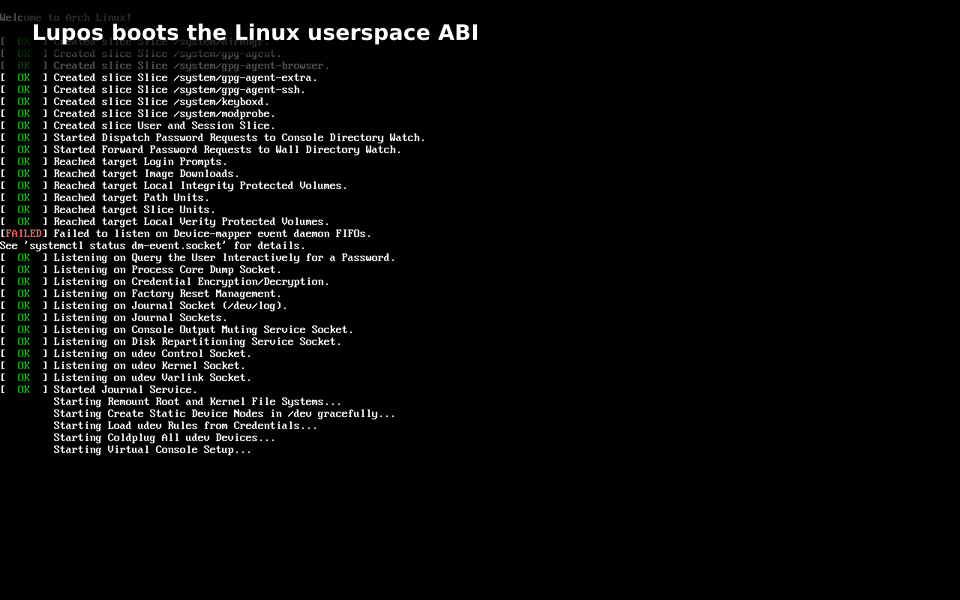
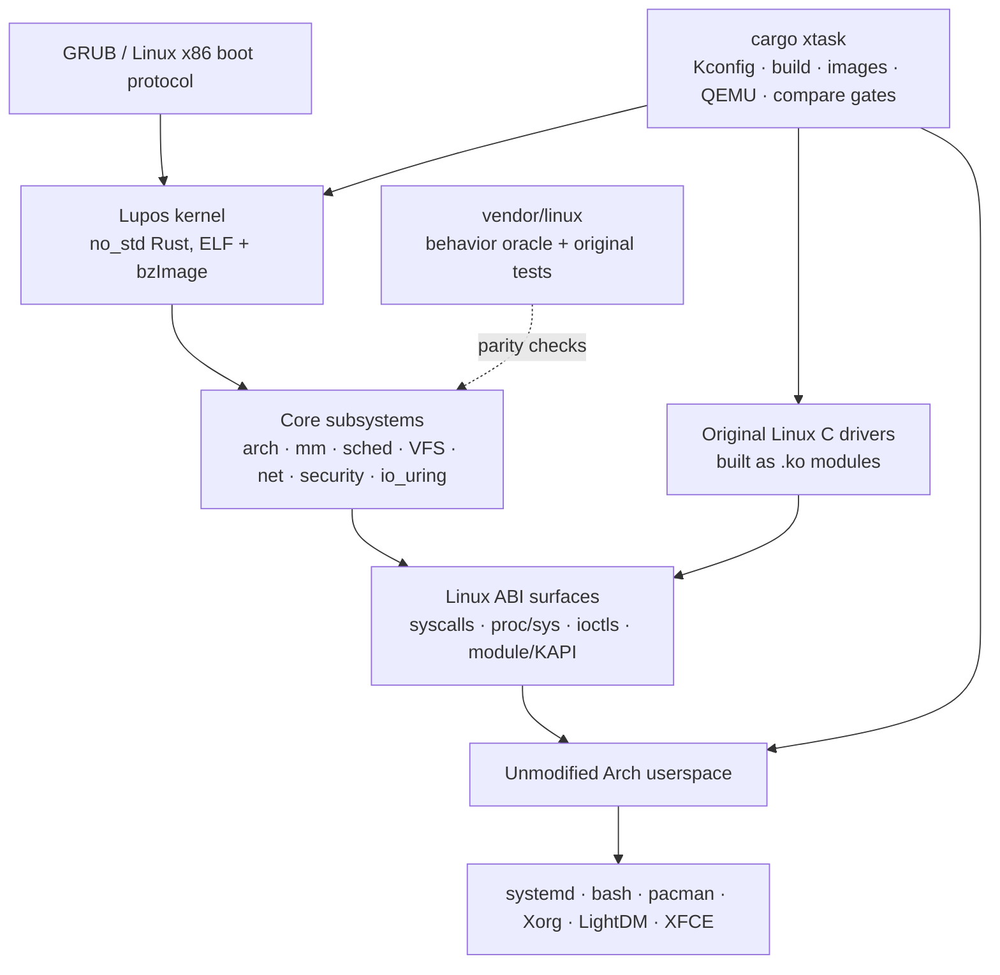

# Lupos

**A Rust reimplementation of the Linux kernel ABI, targeting x86_64 first.**

<p align="center">
  
</p>

> **What “Linux-compatible” means today:** Lupos implements enough of the
> Linux x86_64 userspace and driver ABIs to boot an **unmodified Arch Linux
> userland** in QEMU, reach systemd/LightDM, and run Xorg and XFCE 4.20. It does
> **not** mean full Linux compatibility: many interfaces are partial, hardware
> coverage is narrow, and no workload should assume parity unless its path has
> been tested. The goal is identical observable Linux behavior; the current
> release is an experimental step toward it, not a drop-in Linux replacement.

**[Watch the technical showcase (MP4)](./branding/lupos-showcase.mp4)** ·
**[Build it](#build-and-reproduce)** · **[Architecture](#architecture)** ·
**[Limitations and security](#known-limitations-and-security-warnings)** ·
**[AI disclosure](#how-ai-was-used)** ·
**[Contributing](./CONTRIBUTING.md)** · **[GPL-2.0-only](./LICENSE)**

The animation above is a project capture, not a mock-up. It shows Lupos handing
off to the same Arch binaries used on Linux. The final desktop is running
`bash`, `pacman`, Xorg, XFCE and `fastfetch` on `Lupos 0.1.0-lupos`.

## Project status

Lupos is a research project and a deliberately ambitious compatibility
experiment. Its contract is Linux's externally observable behavior: syscall
results and `errno`, data layouts, filesystems, signals, ioctls, `/proc`,
`/sys`, networking and the kernel-module interface.

The current evidence is narrower than that contract:

- Primary target: x86_64 guests under QEMU on a native Linux host.
- Demonstrated userland: the pinned Arch bootstrap plus systemd, LightDM, Xorg
  on fbdev and XFCE.
- Demonstrated devices: serial/VGA/framebuffer, virtio block and networking,
  PCI, PS/2 input, xHCI/USB paths and Intel HDA paths in the supplied QEMU
  profile. Coverage varies by device and test mode.
- VirtualBox can boot selected configurations, but remains experimental.
- The source-parity audit currently records 2,454 Rust implementation units:
  1,821 marked `complete`, 567 `partial`, and 66 `stub`. These are
  project-maintained implementation tags, **not** proof of whole-kernel
  compatibility.
- The strongest evidence is the test path: original Linux tests are built and
  run against Lupos, with Linux/Lupos result comparison where supported.

Drivers are an important exception to “written in Rust”: Lupos intentionally
builds original Linux C driver sources as `.ko` files and loads them through
its Linux-compatible kernel-module ABI. Kernel core and compatibility layers
under `src/` are Rust; the complete image is not Rust-only.

## Build and reproduce

### Host requirements

Use a native x86_64 Linux host. Debian/Ubuntu package names are shown; install
their equivalents on other distributions:

```bash
sudo apt install build-essential fakeroot nasm grub-pc-bin xorriso mtools \
  curl ca-certificates qemu-system-x86 xfonts-utils
```

`xfonts-utils` supplies `mkfontdir` for the graphical image. On Arch, use
`xorg-mkfontscale`. The GUI needs a working QEMU display; headless tests do not.

Install the Rust components selected by [`rust-toolchain.toml`](rust-toolchain.toml):

```bash
rustup toolchain install nightly
rustup component add llvm-tools-preview rust-src rustfmt --toolchain nightly
```

Populate the ignored Linux reference tree once:

```bash
./vendor/setup_linux.sh
```

### Build

```bash
make config
make kernel   # pure Lupos ELF + Linux-style bzImage
make image    # kernel + pinned Arch userland + GRUB ISO + ext4 root disk
```

The equivalent direct commands are:

```bash
cargo xtask build
cargo xtask build --userland --iso
```

Artifacts are written under `target/xtask/`; the image command prints the
exact ISO and `login.raw` root-disk paths. The image builder downloads
`archlinux-bootstrap-2026.06.01-x86_64` from the Arch archive, extracts it
without root/chroot/mounts, and stages the Lupos overlay.

### Reproduce the boot shown above

```bash
cargo xtask run --gui
```

The first graphical run stages additional X11/XFCE packages and can take a
while. At the LightDM greeter, log in as `root` / `lupos`:

```text
user: root
password: lupos
```

For a fast terminal boot or a CI-safe headless smoke:

```bash
cargo xtask run --terminal
cargo xtask run --headless
cargo xtask run --ping-smoke
```

For QEMU/GDB debugging:

```bash
cargo xtask run --terminal --gdb
cargo xtask run --gui --gdb
```

### Reproducibility boundary

The Arch bootstrap date is pinned, but builds are not yet bit-for-bit
reproducible: the toolchain channel is floating `nightly`, graphical packages
are resolved while staging, build metadata can vary, and downloaded inputs are
not yet locked by a repository-wide checksum manifest. Record
`rustc -Vv`, `cargo -V`, the host package versions and artifact hashes when
publishing results:

```bash
rustc -Vv
cargo -V
sha256sum target/xtask/bzImage target/xtask/*.iso target/xtask/login.raw
```

To deliberately refresh the cached Arch userland:

```bash
LUPOS_ARCH_REFRESH=1 cargo xtask build --userland --iso
```

The README animation and showcase video can be regenerated from the checked-in
project captures with an FFmpeg build that includes libass and libx264:

```bash
scripts/build-showcase.sh
```

## Architecture



The repository follows the Linux source layout so implementations can be
compared directly:

- `src/arch/x86/`: boot protocol, CPU, interrupts and x86-specific memory code.
- `src/kernel/`, `src/mm/`, `src/fs/`, `src/net/`, `src/security/`,
  `src/io_uring/`: Rust kernel subsystems and Linux-shaped interfaces.
- `src/linux_driver_abi/`: the bridge used by original Linux driver modules.
- `configs/lupos_defconfig`: shared generic x86_64 Kconfig baseline.
- `xtask/`: build orchestration, rootfs/ISO construction, QEMU modes, parity
  audits and test runners.
- `vendor/linux/`: ignored local checkout used as the behavioral source of
  truth, driver source and upstream test source.

At boot, the Linux x86 header hands a `boot_params` zeropage to the Rust entry.
Lupos initializes its core, unpacks the early initramfs, loads configured
Linux-built modules, attaches the ext4 root disk, and executes the Arch
userspace's `/sbin/init`.

## Test

```bash
cargo xtask test
```

The default gate runs formatting, both Rust unit suites, the
driver-binary-only policy scan, layout/parity audits and the critical-runtime
stub gate. Deeper runtime gates are explicit because they boot QEMU:

```bash
cargo xtask test --boot
cargo xtask test --mode module-loader
cargo xtask test --mode userspace-smoke
cargo xtask test --mode runtime-stress
cargo xtask test --modules
cargo xtask test --all
```

A green project test proves only the paths covered by that test. It is not a
general Linux conformance certificate.

## Known limitations and security warnings

> **Do not use Lupos for production, secrets, untrusted workloads, or as a
> security boundary. Run it in a disposable VM with no sensitive disks or
> host directories attached.**

- Full Linux ABI parity has not been reached. Untested syscalls, ioctls,
  filesystems, namespace interactions and error paths may be absent or wrong.
- Security subsystems and mitigations are incomplete and have not received an
  independent security audit. Memory-safe Rust does not make unsafe code,
  assembly, FFI, C drivers or logic automatically safe.
- Hardware support is intentionally narrow. QEMU is the primary environment;
  bare metal is unsupported, and VirtualBox behavior is experimental.
- The default demo uses a known `root`/`lupos` credential and permissive
  development-oriented VM networking. It is not a hardened image.
- The image downloads and stages external Arch packages. Inputs are not yet
  covered by an end-to-end checksum/SBOM/provenance system.
- A kernel panic, filesystem corruption, hang, guest escape exposure through
  the hypervisor, or silent behavioral divergence must all be treated as
  possible.

See [SECURITY.md](SECURITY.md) before testing security-sensitive behavior.

## How AI was used

Lupos describes itself as primarily AI-made. AI coding agents have been used
throughout the repository to:

- translate and structure Linux behavior into Rust-shaped implementations;
- inspect Linux source, ABI definitions and original tests;
- write build tooling, QEMU test modes, documentation and debugging probes;
- diagnose failures and propose or implement fixes under human direction.

Linux source and tests are the oracle; AI output is not accepted as evidence
by itself. The intended workflow requires a reviewer to compare behavior with
the corresponding `vendor/linux` source and run the relevant original Linux
tests. The parity tags are maintained assertions, not independent validation.

There is no reliable percentage for “how much was written by AI,” and the git
history does not provide complete line-by-line model provenance. Generated
code may contain subtle errors, invented assumptions, insecure unsafe blocks
or license mistakes. Contributions must disclose material AI assistance and
remain the contributor's responsibility; see
[CONTRIBUTING.md](CONTRIBUTING.md#ai-assisted-contributions).

## Contributing and license

Read [CONTRIBUTING.md](CONTRIBUTING.md) before sending a change. The short
version: Linux behavior wins over local convenience, ABI/layout changes need
source evidence, and tests should come from the corresponding upstream Linux
suite whenever possible.

Lupos is licensed under **GPL-2.0-only**; see [LICENSE](LICENSE). Files under
`vendor/`, downloaded userlands, media and third-party material may carry
their own licenses and are not relicensed by the Lupos project.

More background is in the [FAQ](FAQ.md).
