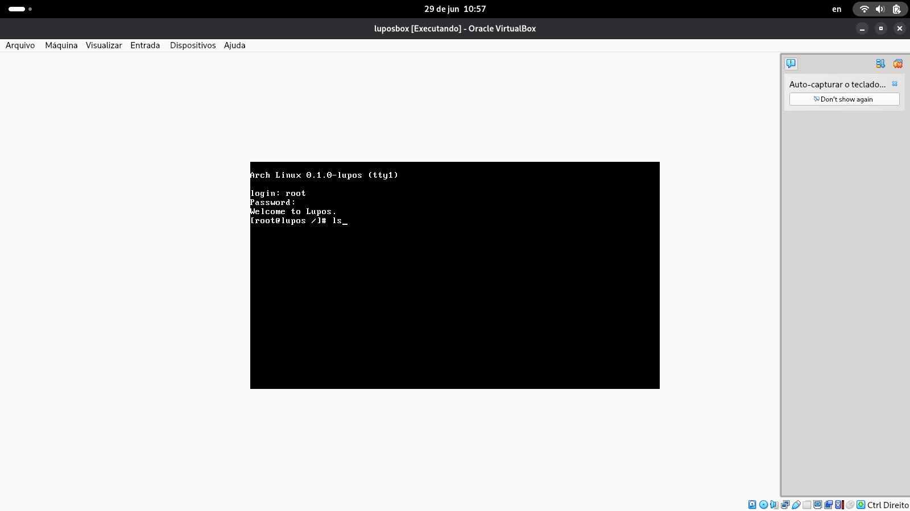

# Lupos - An Operating System made in Rust with AI

Lupos is a Rust reimplementation of the Linux kernel ABI for x86_64 first, with
AArch64 planned later. The success condition is binary-level Linux ABI parity:
binaries built for Linux should observe Linux-compatible syscalls, filesystems,
device interfaces, and process behavior.

<span style="font-style: italic;">Working on virtualbox</span>


The public build surface is intentionally small:

- `make kernel` / `cargo xtask build`: build the pure Lupos kernel, ELF and
  bzImage, from the shared generic x86_64 config.
- `make image` / `cargo xtask build --userland --iso`: build the same kernel,
  stage a minimal Arch `base` userland, and emit a bootable ISO.

Both commands use `configs/lupos_defconfig`, which tracks the overlapping
symbols from Linux's `vendor/linux/arch/x86/configs/x86_64_defconfig`.

## Userland

The default userland is a real Arch `base` rootfs:

- `LUPOS_DISTRO=arch`
- staged guest rootfs: `target/userland/stage`
- root login: `root` / `lupos`
- ping smoke host: `LUPOS_PING_HOST=example.com`

The userland builder downloads the pinned Arch bootstrap tarball, extracts it
unprivileged into `target/userland/`, and applies the Lupos guest overlay. No
root, no chroot, no mounts required.

## Prerequisites

Use a native Linux shell. Install the equivalent of these packages with your
system package manager:

```text
build-essential nasm grub-pc-bin xorriso mtools curl ca-certificates qemu-system-x86
```

The ISO build uses GRUB and `xorriso`. `grub-pc-bin` is required — without it
`grub-mkrescue` builds an EFI-only ISO that QEMU's BIOS cannot boot. QEMU is
required for run and smoke targets.

Populate `vendor/linux` once so the Makefile can build Linux's Kconfig tools:

```bash
./vendor/setup_linux.sh
```

Install the Rust toolchain components:

```bash
rustup toolchain install nightly
rustup component add llvm-tools-preview rust-src --toolchain nightly
```

## Build

Configure once, then use one of the two canonical build commands:

```bash
make config
make kernel
make image
```

Equivalent xtask commands:

```bash
cargo xtask build
cargo xtask build --userland --iso
```

Backend build products remain available for focused work:

```bash
cargo xtask build --modules
cargo xtask build --modules-install
cargo xtask build --all
```

To refresh the Arch userland:

```bash
LUPOS_ARCH_REFRESH=1 cargo xtask build --userland --iso
```

## Run

Boot in dev mode with a visible QEMU display:

```bash
cargo xtask run
```

Log in as `root` with password `lupos`. QEMU exposes the same baseline devices
for automated and display boots: framebuffer/DRM video, 8250 serial,
virtio-net user networking, xHCI USB with a USB tablet for pointer input, and
Intel HDA audio. The generic config enables the matching Kconfig symbols.

Use the explicit public boot modes when you want a terminal or graphical shell:

```bash
cargo xtask run --terminal
cargo xtask run --gui
```

For QEMU/GDB debugging:

```bash
cargo xtask run --terminal --gdb
cargo xtask run --gui --gdb
```

For automated/headless runs, use the same command with flags:

```bash
cargo xtask run --headless
cargo xtask run --mode module-loader
cargo xtask run --ping-smoke
```

`--ping-smoke` boots Lupos with a static PID 1, exercises the guest DNS and
ICMP socket paths, and emits:

```sh
ping -c 1 example.com
```

Override the host with:

```bash
LUPOS_PING_HOST=example.org cargo xtask run --ping-smoke
```

## Test

```bash
cargo xtask test
```

The default test command runs formatting, both Rust unit suites, the
driver-binary-only policy scan, the core layout/parity audits, and the
critical-runtime stub gate. Deeper gates are flags:

```bash
cargo xtask test --boot
cargo xtask test --mode module-loader
cargo xtask test --mode userspace-smoke
cargo xtask test --mode runtime-stress
cargo xtask test --modules
cargo xtask test --all
```

Linux compliance is proven by original Linux tests cross-built and run against
Lupos, through the suite build/run/compare flow in `cargo xtask`.

## FAQ

Please check [FAQ.md](FAQ.md). If your question is not there, open an issue.
