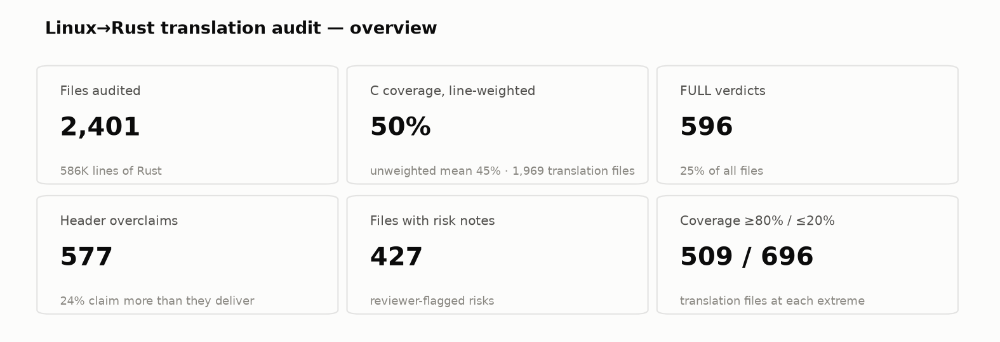
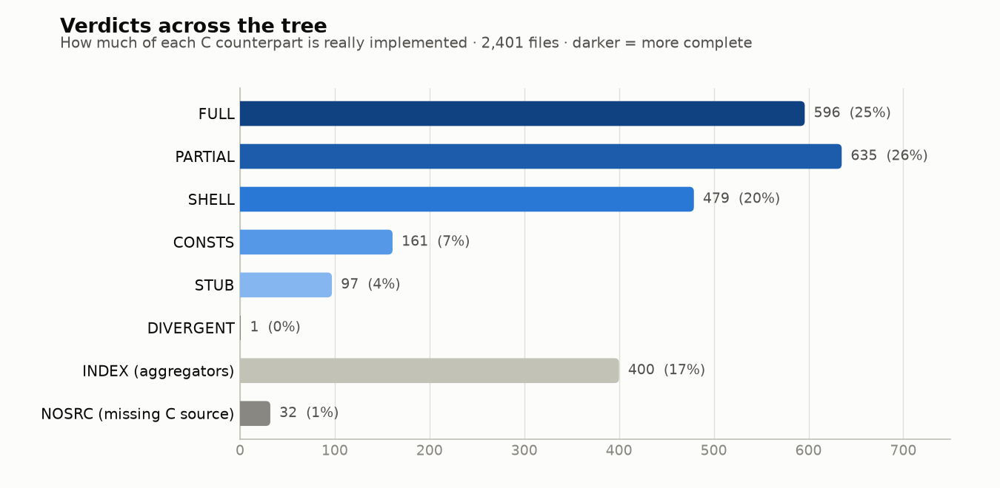
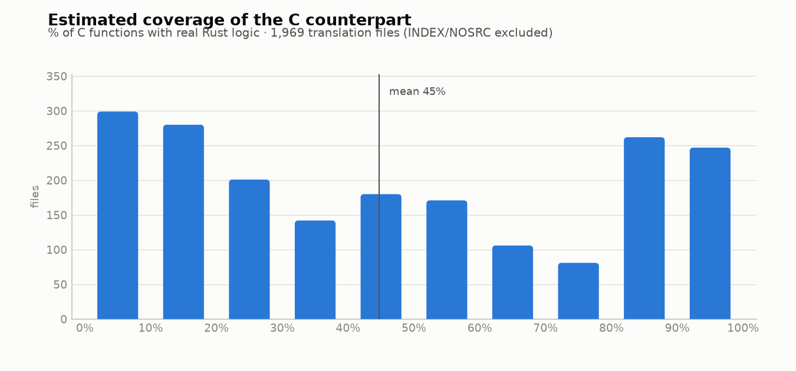
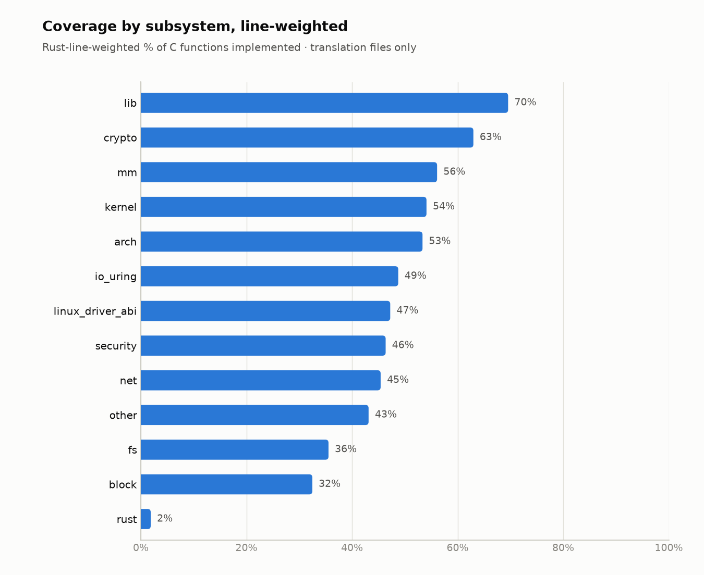
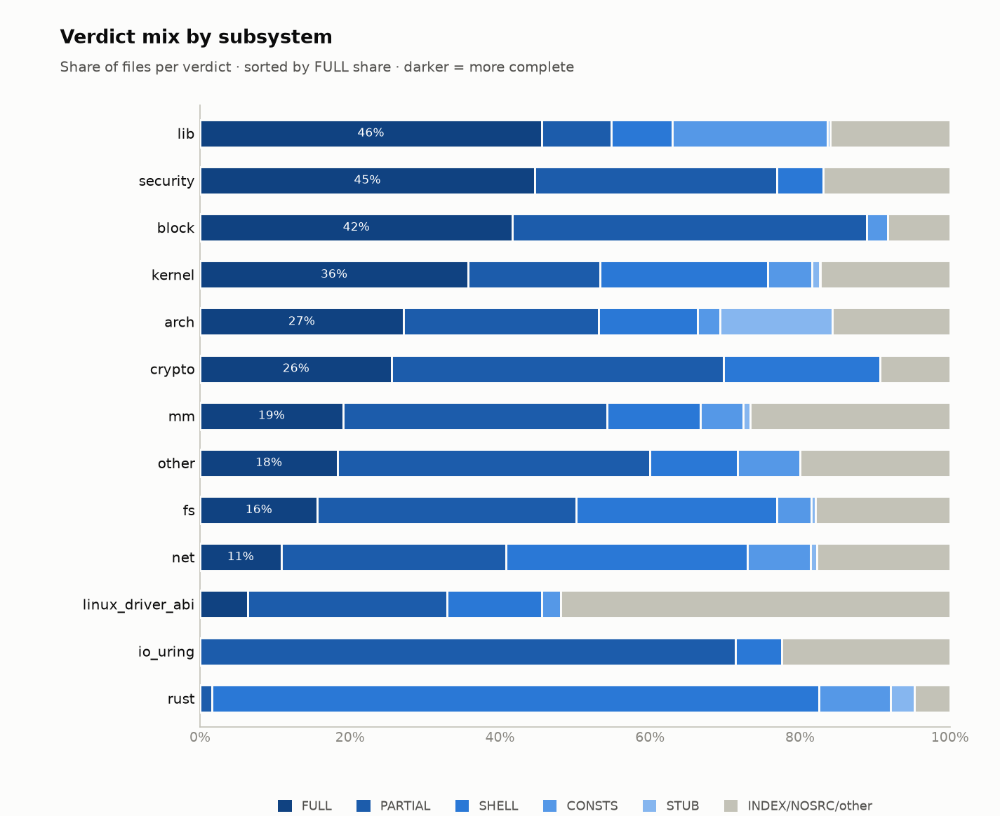
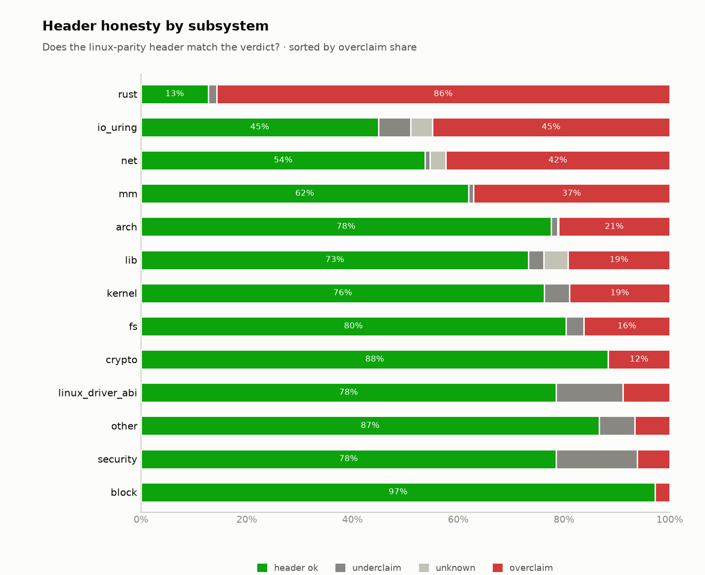
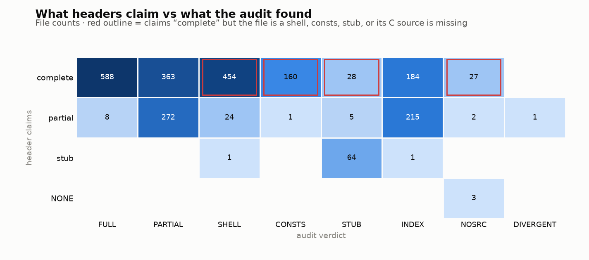
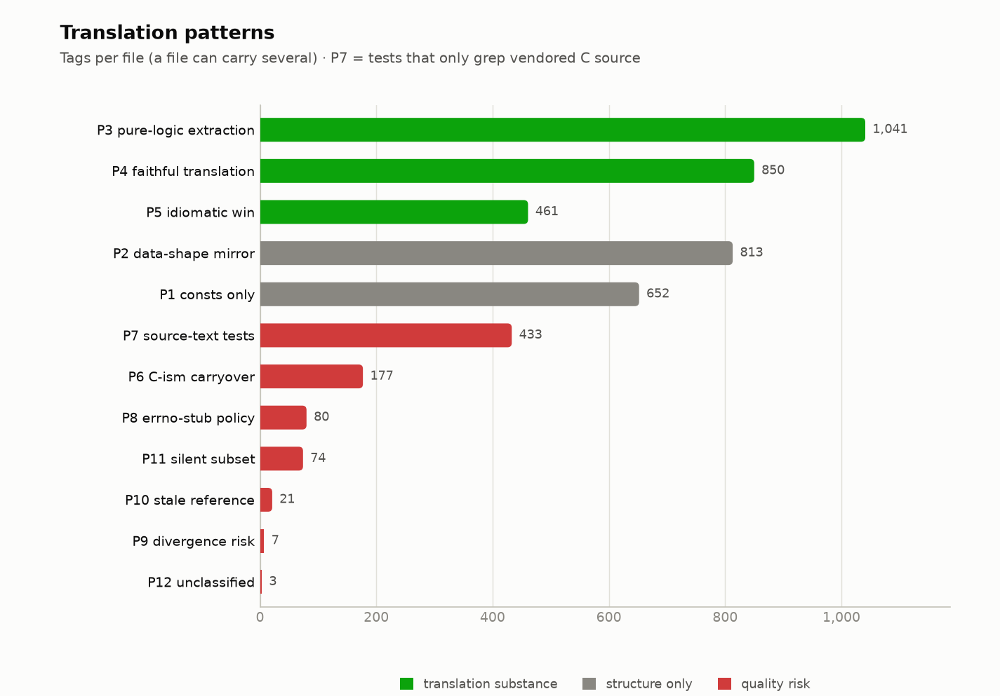
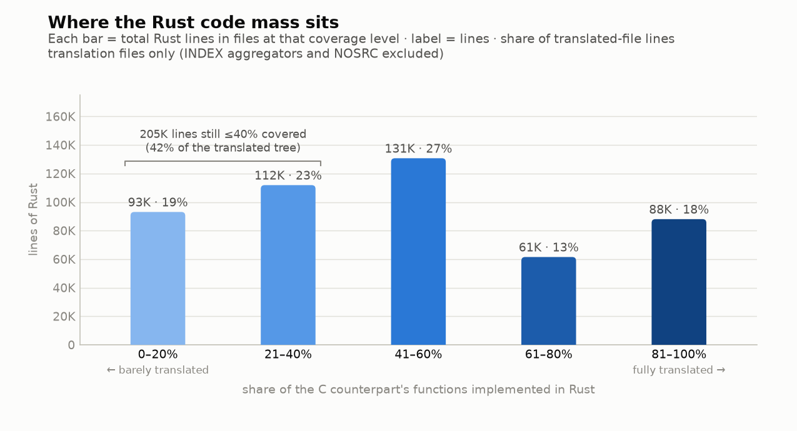

# Translation progress

This page visualizes the repository's current Linux-to-Rust translation audit.
The charts are generated from the checked-in
[`file_verdicts.tsv`](./file_verdicts.tsv), so they provide a reviewable
snapshot of where implementation work is concentrated and where gaps or risks
remain.

> These figures estimate source-translation coverage. They do **not** measure
> Linux compatibility, runtime correctness, test coverage, or production
> readiness. A `FULL` verdict means the audited C counterpart appears to be
> represented; only behavioral comparison and testing can establish parity.



At this snapshot, the audit covers 2,401 files and approximately 586,000 lines
of Rust. Of the 1,969 files classified as translations, estimated coverage is
50% when weighted by Rust lines and 45% as an unweighted per-file mean.

The file counts here should not be compared directly with the implementation
unit tally in the README: this dashboard reports rows in `file_verdicts.tsv`
and separately identifies aggregators and files without a C source
counterpart.

## Completion distribution

The verdict chart classifies each audited file by how much of its C counterpart
is represented. `INDEX` denotes aggregator modules, while `NOSRC` denotes files
without a corresponding C source file.



Coverage estimates are intentionally shown as a distribution. The mean alone
hides the large number of files near both ends of the range.



## Subsystem view

Line-weighted coverage shows where translated Rust code is most and least
complete by subsystem.



The verdict mix complements that estimate by showing the share of audited files
in each verdict class.



## Claims and review risk

The audit compares each file's `linux-parity` header claim with its review
verdict. Green indicates that the claim matches the verdict; red indicates that
the header claims more completeness than the audit found.



The matrix below exposes the specific claim/verdict combinations. Red outlines
highlight files claiming `complete` whose audit verdict is `SHELL`, `CONSTS`,
`STUB`, or `NOSRC`.



Translation-pattern tags record both substantive implementation approaches and
review risks. A file can carry more than one tag, so these counts are not
mutually exclusive.



## Where the code mass sits

This final view weights coverage bands by Rust lines. It helps distinguish
numerous small files from incomplete areas containing a large amount of code.



## Updating the dashboard

After updating `file_verdicts.tsv`, regenerate the checked-in plots from the
repository root:

```bash
python3 plot_file_verdicts.py file_verdicts.tsv translation_plots
```

Reviewers should treat changes to the TSV and generated plots like other audit
evidence: check the corresponding Linux source and run the relevant original
Linux tests before upgrading a verdict or coverage estimate.
